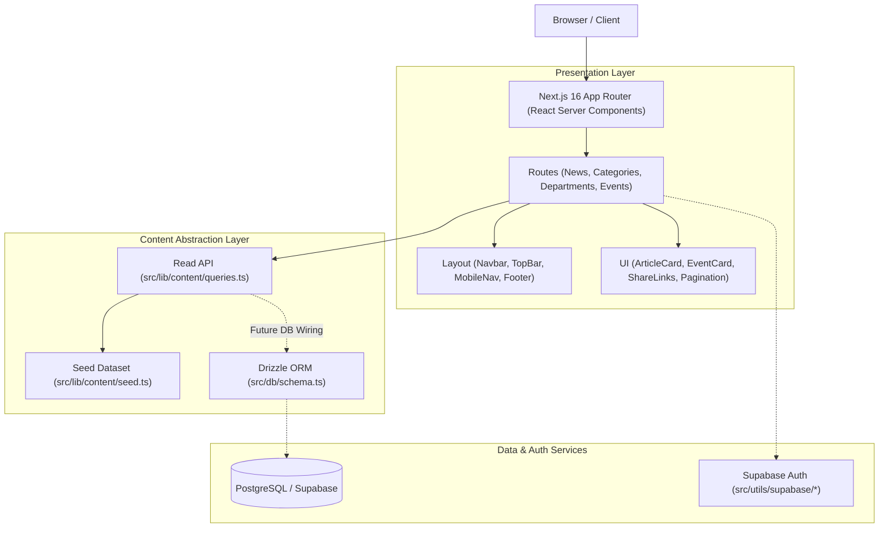

# PTI News — Campus Digital News & Events Platform

Official digital information hub for the **Petroleum Training Institute (PTI), Effurun** — providing comprehensive coverage of campus news, academic department activities, institutional events, and professional certificate programs.

Built with **Next.js 16 (App Router)**, **React 19**, **Tailwind CSS v4**, **Drizzle ORM**, and **Supabase SSR**.

---

## Quick Start (Zero Config)

Get the project running locally in 2 simple commands. No database setup or `.env` file is required out of the box — the content layer uses a built-in seed dataset.

```bash
# 1. Install dependencies
npm install

# 2. Launch development server
npm run dev
```

Open [http://localhost:3000](http://localhost:3000) in your browser.

---

## 🌟 Key Features

- **Dynamic Campus News**: Categorized articles (Academics, Research, Sports, Campus Life) with pagination and search/filter support.
- **Breaking News Ticker**: Instant visual alerts for time-sensitive announcements.
- **Departmental Directory**: Profiles for PTI academic departments and specialized training units.
- **Campus Events Calendar**: Live tracking of upcoming workshops, seminars, matriculations, and past archives.
- **Certificate Courses Showcase**: Specialized petroleum industry short courses and training modules.
- **Decoupled Architecture**: Abstracted data access layer allows zero-config local prototyping while being fully ready for PostgreSQL deployment.
- **Responsive & Accessible UI**: Custom navigation, mobile drawer menu, dark mode styling elements, and share utilities.

---

## 🏗️ Architecture Overview



For full deep-dive architectural specifications, data contracts, and entity relationship diagrams, see [PROJECT_CONTEXT.md](file:///c:/Users/HP/Desktop/projects/campus-website-news/PROJECT_CONTEXT.md).

---

## 📁 Directory Layout

```
campus-website-news/
├── PROJECT_CONTEXT.md      # Full architecture & domain documentation
├── README.md               # Quick start & repository summary
├── package.json            # Scripts and dependencies
├── playwright.config.ts    # End-to-end testing config
├── src/
│   ├── app/                # App Router pages and routes
│   │   ├── category/[slug] # Category listing pages
│   │   ├── departments/    # Department portal pages
│   │   ├── events/         # Event detail & archive pages
│   │   ├── news/[slug]     # News article detail pages
│   │   └── page.tsx        # Homepage layout
│   ├── components/         # Reusable UI & Layout components
│   │   ├── layout/         # Header, TopBar, Footer, MobileNav
│   │   └── ui/             # ArticleCard, EventCard, Pill, ShareLinks
│   ├── db/                 # Drizzle ORM schema & Postgres client
│   │   ├── index.ts        # Database client setup
│   │   └── schema.ts       # Database table definitions
│   ├── lib/                # Business logic & content layer
│   │   ├── content/        # Query functions, interfaces, seed data
│   │   ├── format.ts       # Timezone & date formatting
│   │   └── site.ts         # Canonical site URL resolver
│   └── utils/              # Supabase SSR & browser helpers
└── tests/                  # Playwright E2E tests
```

---

## 🚦 Available Scripts

| Command | Action |
| :--- | :--- |
| `npm run dev` | Starts the local development server at `localhost:3000` |
| `npm run build` | Builds optimized production bundle |
| `npm start` | Launches production server build |
| `npm run lint` | Runs ESLint validation across the repository |
| `npm run typecheck` | Executes TypeScript type checking (`tsc --noEmit`) |
| `npx playwright test` | Runs end-to-end browser tests |

---

## ⚙️ Environment Variables

Creating `.env.local` is optional for initial setup. When deploying to Vercel or connecting to live PostgreSQL/Supabase instances, configure these variables:

| Variable | Required? | Purpose |
| :--- | :--- | :--- |
| `NEXT_PUBLIC_SITE_URL` | Optional | Canonical site origin for OpenGraph images and social sharing. Defaults to Vercel domain if unconfigured. |
| `DATABASE_URL` | Optional | PostgreSQL connection string for Drizzle ORM queries (`src/db/schema.ts`). |
| `NEXT_PUBLIC_SUPABASE_URL` | Optional | Supabase project endpoint URL. |
| `NEXT_PUBLIC_SUPABASE_ANON_KEY` | Optional | Supabase anonymous API key for browser/server helpers. |

---

## 🚢 Deployment (Vercel)

1. Push your code to GitHub.
2. Import the project on [Vercel](https://vercel.com/new).
3. Framework settings (Next.js), build command (`npm run build`), and output directory are automatically detected.
4. (Optional) Set `NEXT_PUBLIC_SITE_URL` in **Project Settings → Environment Variables** once a custom domain is assigned (e.g. `https://news.pti.edu.ng`).

---

## 📄 Documentation

For full implementation details, database ER diagrams, data flow diagrams, entity models, and migration guides, refer to:
👉 **[PROJECT_CONTEXT.md](file:///c:/Users/HP/Desktop/projects/campus-website-news/PROJECT_CONTEXT.md)**
