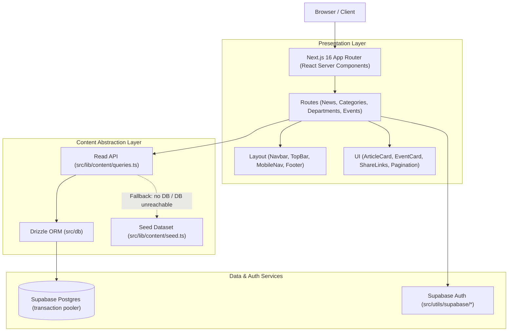

# PTI News — Campus Digital News & Events Platform

Official digital information hub for the **Petroleum Training Institute (PTI), Effurun** — providing comprehensive coverage of campus news, academic department activities, institutional events, and professional certificate programs.

Built with **Next.js 16 (App Router)**, **React 19**, **Tailwind CSS v4**, **Drizzle ORM**, and **Supabase SSR**.

---

## Quick Start (Zero Config)

Get the project running locally in 2 simple commands. No database setup or `.env` file is required out of the box — the content layer uses a built-in seed dataset.

```bash
# 1. Install dependencies
npm install

# 2. Launch development server
npm run dev
```

Open [http://localhost:3000](http://localhost:3000) in your browser.

News, events and department content are served from a built-in seed dataset
(`src/lib/content`), so the public site is fully populated with no database.

With Supabase configured (see [Environment Variables](#️-environment-variables)),
content, comments, reactions and newsletter sign-ups come from Postgres and
sign-in uses Supabase Auth. The seed data stays as the fallback: if the
database is unreachable, pages keep rendering from it.

---

## 🔐 Sign-in

Two sign-in entry points:

- **Students & lecturers:** [`/login`](http://localhost:3000/login) → the campus
  news **Portal** (`/portal`)
- **Administrators:** [`/admin/login`](http://localhost:3000/admin/login) → the
  **Admin dashboard** (`/admin`)

**With Supabase Auth** (URL + publishable key set), people create accounts at
`/signup` as a student or lecturer. Administrators are never self-registered:
promote an existing account with
`npm run auth:set-role -- their@email.com admin`. Roles are stored in the
account's `app_metadata`, which users cannot edit.

New accounts confirm their email with a **code, not a link**: sign-up sends a
numeric code and the person types it in at `/verify` (with a "Send a new code"
button). Nothing depends on the email being opened in the same browser. For the
code to appear, Supabase's **Confirm signup** template must include
`{{ .Token }}` — see [Supabase setup](#supabase-setup) below. Links still work
for anything already sent: `/auth/confirm` (and `/auth/callback`) handle them,
and a link that lands on the wrong path is forwarded there.

Sign-up asks for the person's department (students and lecturers alike).
Afterwards they can edit their own name, department, password — and, for staff,
their job title — at [`/portal/settings`](http://localhost:3000/portal/settings);
administrators get the same forms on their own Settings page. Roles and email
addresses are not self-editable.

`npm run auth:seed-users` creates a starter set of confirmed accounts (1 admin,
2 lecturers, 2 students — the same people as the demo accounts below) with
freshly generated passwords, printed once. Re-running it leaves existing
accounts alone; add `-- --reset-passwords` to issue new passwords.

**Without Supabase**, a hardcoded demo takes over so the app can still be
signed into out of the box:

| Role | Email | Password |
| :--- | :--- | :--- |
| Administrator | `admin@pti.edu.ng` | `admin123` |
| Lecturer | `lecturer@pti.edu.ng` | `lecturer123` |
| Lecturer | `amaka.okafor@pti.edu.ng` | `lecturer123` |
| Student | `student@pti.edu.ng` | `student123` |
| Student | `blessing.okowa@pti.edu.ng` | `student123` |

The full list is defined in `src/lib/auth/demo-users.ts`, and each login page
also displays the relevant credentials in demo mode. These accounts and the
cookie-based demo session are throwaway plumbing — **not** a secure auth
system — which is why they are switched off entirely once Supabase is set up.

---

## 🌟 Key Features

- **Dynamic Campus News**: Categorized articles (Academics, Research, Sports, Campus Life) with pagination and search/filter support.
- **Breaking News Ticker**: Instant visual alerts for time-sensitive announcements.
- **Departmental Directory**: Profiles for PTI academic departments and specialized training units.
- **Campus Events Calendar**: Live tracking of upcoming workshops, seminars, matriculations, and past archives.
- **Certificate Courses Showcase**: Specialized petroleum industry short courses and training modules.
- **Decoupled Architecture**: Abstracted data access layer allows zero-config local prototyping while being fully ready for PostgreSQL deployment.
- **Responsive & Accessible UI**: Custom navigation, mobile drawer menu, dark mode styling elements, and share utilities.

---

## 🏗️ Architecture Overview



For full deep-dive architectural specifications, data contracts, and entity relationship diagrams, see [PROJECT_CONTEXT.md](file:///c:/Users/HP/Desktop/projects/campus-website-news/PROJECT_CONTEXT.md).

---

## 📁 Directory Layout

```
campus-website-news/
├── PROJECT_CONTEXT.md      # Full architecture & domain documentation
├── README.md               # Quick start & repository summary
├── package.json            # Scripts and dependencies
├── playwright.config.ts    # End-to-end testing config
├── src/
│   ├── app/                # App Router pages and routes
│   │   ├── category/[slug] # Category listing pages
│   │   ├── departments/    # Department portal pages
│   │   ├── events/         # Event detail & archive pages
│   │   ├── news/[slug]     # News article detail pages
│   │   └── page.tsx        # Homepage layout
│   ├── components/         # Reusable UI & Layout components
│   │   ├── layout/         # Header, TopBar, Footer, MobileNav
│   │   └── ui/             # ArticleCard, EventCard, Pill, ShareLinks
│   ├── db/                 # Drizzle ORM schema & Postgres client
│   │   ├── index.ts        # Database client setup
│   │   └── schema.ts       # Database table definitions
│   ├── lib/                # Business logic & content layer
│   │   ├── content/        # Query functions, interfaces, seed data
│   │   ├── format.ts       # Timezone & date formatting
│   │   └── site.ts         # Canonical site URL resolver
│   └── utils/              # Supabase SSR & browser helpers
└── tests/                  # Playwright E2E tests
```

---

## 🚦 Available Scripts

| Command | Action |
| :--- | :--- |
| `npm run dev` | Starts the local development server at `localhost:3000` |
| `npm run build` | Builds optimized production bundle |
| `npm start` | Launches production server build |
| `npm run lint` | Runs ESLint validation across the repository |
| `npm run typecheck` | Executes TypeScript type checking (`tsc --noEmit`) |
| `npx playwright test` | Runs end-to-end browser tests |
| `npm run supabase:check` | Verifies every Supabase variable in `.env.local` actually works (prints no secrets) |
| `npm run db:generate` | Generates a migration in `drizzle/` after changing `src/db/schema.ts` |
| `npm run db:migrate` | Applies pending migrations to `DATABASE_URL` |
| `npm run db:seed` | Loads the built-in seed content into the database (safe to re-run) |
| `npm run auth:set-role -- <email> <role>` | Sets an account's role (`admin`, `lecturer`, `student`) |
| `npm run auth:seed-users` | Creates the starter Supabase accounts (1 admin, 2 lecturers, 2 students) and prints their passwords |

---

## ⚙️ Environment Variables

All optional — each one switches a piece from the built-in fallback to
Supabase. See `.env.example` for details, and run `npm run supabase:check`
after changing them.

| Variable | Purpose |
| :--- | :--- |
| `NEXT_PUBLIC_SITE_URL` | Canonical site origin for OpenGraph and share links. Defaults to the Vercel domain; don't set it to localhost on Vercel. |
| `DATABASE_URL` | Supabase **Transaction pooler** URI (port 6543). Without it, content comes from the seed dataset. The direct `db.<ref>.supabase.co` host is IPv6-only and won't work on Vercel. |
| `NEXT_PUBLIC_SUPABASE_URL` | Supabase project URL. |
| `NEXT_PUBLIC_SUPABASE_PUBLISHABLE_KEY` | Publishable key (`NEXT_PUBLIC_SUPABASE_ANON_KEY` also accepted). With the URL, turns on Supabase Auth and disables the demo accounts. |
| `SUPABASE_SERVICE_ROLE_KEY` | **Server-only** secret key. Saves the role chosen at sign-up and powers the admin Users page. Never prefix with `NEXT_PUBLIC_`. |

### Supabase setup

In the Supabase dashboard:

1. **Authentication → Emails → Confirm signup**: include `{{ .Token }}` so the
   email carries a code. For example:
   ```html
   <h2>Confirm your PTI News account</h2>
   <p>Enter this code to finish signing up:</p>
   <p style="font-size:28px;letter-spacing:6px;font-weight:bold">{{ .Token }}</p>
   <p>The code expires in one hour. If you didn't sign up, ignore this email.</p>
   ```
2. **Authentication → URL Configuration**: set **Site URL** to the live site
   (not `http://localhost:3000`, the default) and add both
   `https://<your-domain>/**` and `http://localhost:3000/**` to **Redirect
   URLs**. Supabase falls back to the Site URL whenever a redirect target is not
   on that list, which is what sends people to a dead page.
3. **Authentication → Emails → SMTP Settings**: the built-in mailer only
   delivers to members of your Supabase organisation and allows a few messages
   an hour. Add your own SMTP before real sign-ups.

### First-time database setup

```bash
npm run db:migrate   # create the tables (row-level security on every table)
npm run db:seed      # load the built-in articles, events and departments
npm run supabase:check
```

Every table has row-level security enabled with no policies: the app talks to
Postgres directly through the pooler, while Supabase's public Data API (reachable
with the browser-visible publishable key) can read and write nothing.

---

## 🚢 Deployment (Vercel)

1. Push your code to GitHub.
2. Import the project on [Vercel](https://vercel.com/new).
3. Framework settings (Next.js), build command (`npm run build`), and output directory are automatically detected.
4. Add the variables above in **Project Settings → Environment Variables**, then redeploy (`NEXT_PUBLIC_*` values are baked in at build time).
5. In Supabase, open **Authentication → URL Configuration**: set **Site URL** to the production URL and add `https://<your-domain>/**` (and `http://localhost:3000/**` for local work) to **Redirect URLs**, so confirmation emails link back to the site.
6. Recommended: set the Vercel **Function Region** to the one closest to the database (for a Supabase project in `eu-west-1`, that's Dublin, `dub1`). Every page makes several queries, so this matters.
7. Open **/admin/settings** on the deployment — the **Backend status** panel confirms the database and auth are connected.

---

## 📄 Documentation

For full implementation details, database ER diagrams, data flow diagrams, entity models, and migration guides, refer to:
👉 **[PROJECT_CONTEXT.md](file:///c:/Users/HP/Desktop/projects/campus-website-news/PROJECT_CONTEXT.md)**
